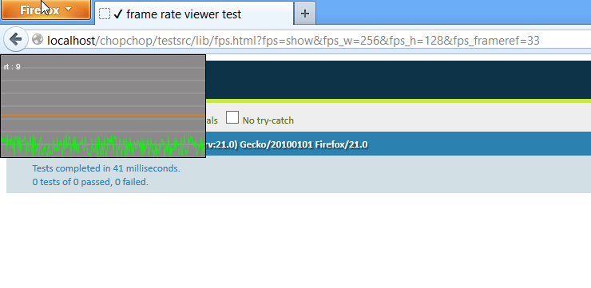

#chopchop.js#

Assorted functionality for asynchronous processing.

1. IterableMixin: a mixin with asynchronous array comprehension methods (map, reduce, groupBy, filter) for iterables.
It works with arrays or iterators.
2. Promise: lightweight PromiseA implementationand
3. animationFrame: a polyfill for the browser's native requestAnimationFrame. It includes a framerate display you can add
to your webpage during development.

##1. IterableMixin##
A mixin for iterators, specifically designed for asynchronous collection comprehension. Supports basic  <code>map, filter, reduce<code> </code>and groupBy</code> functionality.

It works with arrays (the native JS Array) and iterators (any object which implements .next()).

It is particularly useful for applications which need to keep the UI responsive
or to prevent stop-script errors when performing long running computation in loops (e.g. games, visualization software).

The general idea is that elements from the collection (represented by the Array or iterator) are processed in small batches.

You can configure this process (for example, set a time-limit on the duration of a batch, or a limit on the maximum number of elements that can be processed).

All methods use thenables (CommonJS PromiseA) to represent the asynchronous values.

Use <code>.augment().</code> to extend an iterator with the functionality.

    define([
        'path/to/IteratorMixin'
    ], function(IteratorMixin){

        //an iterator must implement next.
        var iterator = {
            next: function(){
                ... return the next element of the iteration or throw an error when the end has been reached ...
            }
        };

        IteratorMixin.augment(iterator);
    });

Below is an example of an iterator for an array. Note that you get this for free since all methods work
both with arrays and iterators alike. But it is a good real-life example of how you could implement an Iterator.

    function ArrayIterator(array){
        this._a = array;
        this._current = 0;
    }
    ArrayIterator.prototype = {
        next: function(){
            if (this._current >= this._a.length){
                throw 'Stop!';
            }
            var nextElement = this._a[this._current];
            this._current += 1;
            return nextElement;
        }
    }

    arrayIterator = new ArrayIterator([1,2,3,4]);
    arrayIterator.next();//is 1
    arrayIterator.next();//is 2
    arrayIterator.next();//is 3
    arrayIterator.next();//is 4
    arrayIterator.next();//throw stop error

###map, filter, reduce and group asynchronously###

Use any of the asynchronous methods to process elements of the iterator in small increments.

The return is a thenable (see CommonJS - Promise/A)[http://wiki.commonjs.org/wiki/Promises/A]

A thenable has a then-method, which takes 3 parameters, all of them functions:

1. a callback handle for when the end thenable has resolved,
2. an error handle
3. a progress handle.

####.mapAsync(mapFunction,options)####

Takes a single map function as parameter.

Returns a promise for a new collection, which contains all mapped items.

    function map(item){
        var mappedItem =
            ...
            map item into a new value
            ...
        return mappedItem;
    }

    iterator
       .mapAsync(map)
       .then(function successHandler(mappedCollection){
            //mappedCollection is an Array where each element
            //is the result of the map function
            //applied to an element of the iterator.
        });

####.reduceAsync(foldFunction,initialValue,options)####

Reduce all elements from an iterator to a single value. This takes two parameters:

1. a 'fold' function which combines the accumulated value (1st parameter) with a value from the collection (2nd parameter)
2. an initial value

        function sum(a,b){
            return a + b;
        }

        iterator
            .reduceAsync(sum,0)
            .then(function(total){
                console.log("total: " + total);
        });

####.filterAsync(predicateFunction,options)####

Takes a single predicate function and returns a new array which only contains the elements which passes the filter function.

        function equalToOne(item){
            return item === 1;
        }

        iterator
            .filterAsync(equalToOne)
            .then(function(array){
                console.log('every element in this array equals 1: ', array);
            });

####.groupByAsync(hashFunction,options)####

Takes a single hash-fuctions, and groups all elements in a map where the key is the hash, and the value is an array with
the objects that correspond to this hash.

           function sign(n){
                if (n < 0){
                    return 'negative';
                }else if (n === 0){
                    return 'zero';
                }else{
                    return 'positive';
                }
           }

           iterator
                .groupByAsync(sign)
                .then(function(map){
                    //map is an plain-old JS object
                    //where the key is either 'negative','zero', or 'positive'
                    //and the value is an array of the elements that correspond to the hash-function
                });

###The options object: controlling the duration of the iteration###

All methods (mapAsync, reduceAsync, filterAsync, groupByAsync) can take an optional options object as a last parameter.

This object has 3 optional properties:

1. maxIterationTime: a number
2. maxN: an integer specifying how many items may maximally be processed in a single time-step.
3. requestTick: a function taking a single parameter which is a callback function. This function invokes the callback when a next iteration of the can be performed.

####.maxIterationTime###

Specify the maximum duration - in milliseconds - of a single tick. The duraction is approximate, and actual computation in a single callstack
might exceed this value.

    iterator.forEachAsync(function(item){
        console.log("item: ",item);
    },{
        maxIterationTime: 20
    };

####.maxN####

Process no more than n elements in a single tick.

     iterator.forEachAsync(function(item){
            console.log("item: ",item);
        },{
            maxIterationTime: 20
        };

####.requestTick####

A function which invokes a callback. Only elements from the iterator will be processed when the callback function has been called.

    //on FF, this will cause you processing to happen on the natural frame-rate of the browser.
    iterator.forEachAsync(function(item){
            console.log("item: ",item);
        },{
            requestTick: mozRequestAnimationFrame
        };

##2. Promise.js##

A vanilla PromiseA, supporting <code>resolve, reject, progress</code>

It has this sugar.

###.thenable()###

Generates a thenable, which only provides a .then method. The resolve/reject/progress
instance methods are not accessible from this object.

    define(['path/to/Promise'],function(Promise){

        //'promise' has the resolve/reject/progress methods. hold on to this one!
        var promise = new Promise();

        //'thenable' only has a .then subscription method, but not the resolve/reject/progress methods
        //Give this one to the users of your API.
        //it is linked - by quantum entanglement presumably - to the promise which generated it.
        var thenable = promise.thenable();

    });

##3. animationFrame##

A polyfill for all the requestAnimationFrame implementations (firefoz, chrome,ie, safari, opera).

Inspired by Erik Moller's [shim](http://my.opera.com/emoller/blog/2011/12/20/requestanimationframe-for-smart-er-animating).

Some slight improvements include:

    1. The fallback implementation based on setTimeout, will correctly group consecutive frame-requests together,
    and call them in a single 'frame'. This is the same behaviour as the native implementations.
    (of course, this only occurs when these requests follow each other very shortly).
    2. a polyfill for cancelAnimationFrame
    3. a framerate line chart you can add to your webpage (easy for debugging).

###.requestAnimationFrame(callback,[domNode])###

Invokes the callback. Usually, the callback would contain some rendering code (e.g. drawing to a HTML5 canvas).

The return is a handle for that frame.

    define(['path/to/animationFrame'],function(animationFrame){

        //example 1: a simple paint loop
        (function render(){
            animationFrame.requestAnimationFrame(render);
            ... draw something to a canvas here ...
        }();

        //example 2: consecutive frame request are batched together.
        var id1,id2;
        animationFrame.requestAnimationFrame(function(id){
            id1 = id;
        });
        animationFrame.requestAnimationFrame(function(id){
            id2 = id;
        });
        //id1 === id2

    });

###.cancelAnimationFrame(handle)###

Cancels the request.

        var handle = animationFrame.requestAnimationFrame(function(){
            //this will never execute, since the frame is immediately cancelled.
        });
        animationFrame.cancelAnimationFrame(handle);

###?fps=show###

When you use the animationFrame module to request animation frames, you can display a frame-rate line chart by adding fps=show
as a query parameter. This can be useful for debugging.

    http://my.domain.com/some/app?fps=show

The graph can be modified with following parameters (all optional)

1. fps_w: the width of the line chart, in pixels.
2. fps_h: the height of the line chart, in pixels.
3. fps_frameref: the target frame duration, in milliseconds, indicated by a horizontal line. The default is 16 (ca. 60 frames per second).
4. fps_framemax: the maximum frame duration of the line-chart

e.g. a graph measuring 256 by 128 pixels, with a target frame rate of about 30 fps (the orange line).

    http://my.domain.com/some/app?fps=show&fps_w=256&fps_h=128&fps_frameref=33

##The code##

Download the AMD modules here: [AMD modules](./src/lib/).

Find QUnit tests [here](./testsrc/lib/).

